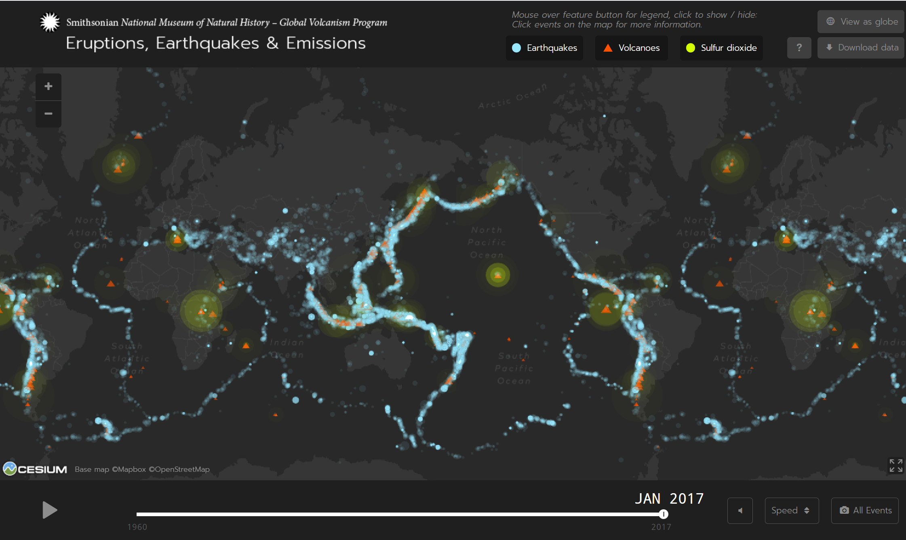
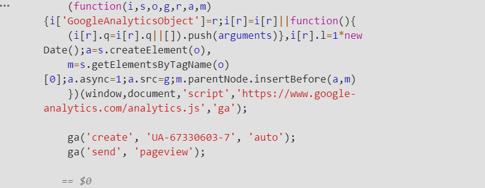
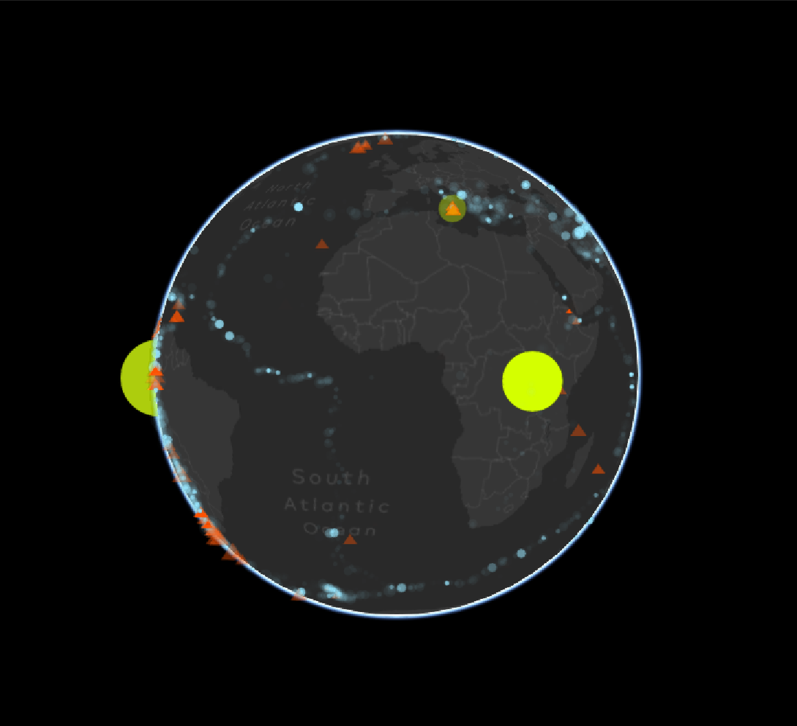

# Visualization of Eruptions, Earthquakes, and Emissions

<b>FIGURE 1.</b> Static image of the interactive eruptions, earthquakes, and emissions map.

### THE FEATURED PROJECT

<b>Map:</b> [Eruptions, Earthquakes, and Emissions](https://volcano.si.axismaps.io/)

<b>Explanation of Project:</b> [Project Overview](https://www.axismaps.com/projects/smithsonian)

### INTRODUCTION

The Eruptions, Earthquakes, and Emissions project, built by Axis Maps for the Smithsonian Institute’s National Museum of Natural History, highlights volcanic activity and earthquakes occurring around the world since 1960. Utilizing eruption and emission data from the [Smithsonian’s Global Volcanism Program](https://volcano.si.edu/), and earthquake data from the [United States Geological Survey (USGS) Earthquake Catalog](https://earthquake.usgs.gov/fdsnws/event/1/), the featured web-based map explores the changes in and locations of volcanic eruptions, sulfur dioxide emissions, and earthquakes. To determine the benefits and importance of analyzing this project, it is necessary to delve further into not only the purpose of the visualization, systematic architecture, and user experience and interface, but also the deeper-rooted context and implications of the data.

When first viewing the map, the time lapse of data automatically begins. From January 1960 to January 2017, eruptions, emissions, and earthquakes are visibly cycled through, taking form of three different symbols that fluctuate in size and prevalence based off quantitative measurements. The first indicated variable, earthquakes, visualizes the locations of known earthquakes. It is symbolized by a blue circle that grows or shrinks respective to its specified magnitude. Only earthquakes with a magnitude of five to ten are populated and displayable on the map. Volcanoes, the second variable, encompasses the volcanic eruptions data. Each data point is measured on a one to ten scale by volcanic explosivity index and is represented by an orange triangle that increases or decreases based on the corresponding index number. Sulfur dioxide emissions, the final variable, which is symbolized by a yellow-green circle, are the gas emissions that occur from volcanic eruptions. This data only appears during and after 1978 and is measured by emissions in kilotons. All these features ultimately are encompassed in the main functions of the map. With controllable sliders and clickable points that change display of information, the map overall creates an interactive experience of analyzing the data. 

The purpose, therefore, of this visualization is to showcase in a clear format the pervasiveness of natural disasters, like volcanic eruptions and earthquakes, and their effects, like sulfur dioxide emissions. Due to the map being specifically built for the Smithsonian Institute, it can be assumed that it is widely used, well developed, and a credible resource for information. Though the project can be found on a few designated sites, its expansive, global view of different environmental phenomenon can apply to a diverse range of organizations, communities, and individuals. Three target audiences that could benefit from this information are residents near or on impacted areas, government officials and workers providing emergency relief in crises, and environmental activists studying the effects of the represented variables. If there are any areas in particular that are hit harder by eruptions or earthquakes than others, more resources could then be allocated to those locations for protection and evacuation. Residents and government officials and workers could better anticipate when certain events would occur so to minimize destruction.

#### General Overview

- <b>Author:</b> Axis Maps
- <b>Built for and with:</b> The Smithsonian Institute’s National Museum of Natural History
- <b>Data:</b> Eruptions, Earthquakes, and Emissions
- <b>Data Resources:</b> [Smithsonian’s Global Volcanism Program](https://volcano.si.edu/) and [United States Geological Survey (USGS) Earthquake Catalog](https://earthquake.usgs.gov/fdsnws/event/1/)

#### Functions

- Time lapse from January 1960 to January 2017
- Symbology representing the eruptions, earthquakes, and emissions
- Slider that allows control of what month and year is being observed
- Clickable points to show the information of each recorded piece of data, including date, magnitude, or location

### SYSTEMATIC ARCHITECTURE

The process of loading, updating, and displaying the data involves the implementation of a secure database and strong website and mapping framework. In the case of this project, rather than the map pulling information directly from the listed programs and resources, it is stored within a postgres database hosted by Axis Maps. The postgres database serves to optimize the data through generalizing locations and removing certain attributes before sending it to the client. When the data is fully stored and condensed, it is then loaded into the map and displayed in a timely manner. Clients can view the populated data and interact with the desired functions without having to be aware of backend procedures. 

As for the website and mapping framework, the structure is primarily built with JavaScript, including the Cesium JavaScript Library. To provide a foundation for high functioning and interactive visualizations, the map utilizes JavaScript, which passes in the data and grants the ability for users to click on symbols for information and a slider to switch to and from different periods of time. From the code shown in Figure 2, it seems that all the data filters into a function which then populates the points on the map. It saves each piece of relevant information and assigns it to a clickable symbol for display. The Cesium library, more specifically, is used to host the WebGL technology. Instead of only having the default view of the map, WebGL produces a 3D globe view. This gives more options to observe the data in its geographic context.

When the clients request the site, the destination server responds by providing the map with all its features and data.

<b>FIGURE 2.</b> View of the code that runs the map on the browser. It contains a function the passes in and populates the data.

<b>FIGURE 3.</b> A capture of the available 3D globe view that is accessible through the Cesium library, which supports WebGL technology.

### USER EXPERIENCE AND INTERFACE

Designing exemplary user interface and experience is necessary to the successful and efficient display of featured information. User experience notably defines the look and overall function of the project, while user interface handles the interactive and more technical elements that users can toggle and select. Observing the visual design of the displayed map, as well as the interactable features, the project is determined to be a highly controllable and explorable hub of data. Its real-time responsiveness to user engagement allows users to select which points and time periods should be showcased. It seems that overall the map grants the perfect ability to formulate analysis and find patterns in the data due to high levels of customizability.

The main portion of the visualization, which is the map, uses an OpenStreetMap basemap generated by Map Box. It sets a baseline for drawn out boundaries and locations and ensures that the data is given a geographic meaning. With a darker theme, it makes the neon-colored symbols stand out and more easily readable. This already creates a better experience for users because of its visually-stimulating and organized design. The thematic layer, on the other hand, contains all the data that is being populated. The eruption, earthquake, emission values are given their representative symbols and placed over the basemap to tie together information and geographic location.

While the visual design of the map can appeal to user experience, the interactivity and functionality of the project are more aligned with the user interface. On the top and lower part of the screen, there are two bars. The top bar spotlights the variables, the name of the institution providing the information, and methods of changing the map view or downloading the data. When hovering over each variable on the bar, it displays the measurements used and the respective symbology. Clicking the variable also turns it off from being shown in the map. As for the lower bar, its main purpose is to control the time lapse, including toggling speed of the time lapse, and change modes of displaying select data or all data. Both bars impact how the data is viewed and what data is being shown. When any feature is changed, the map responds to the request immediately.

### PROS

The positives of this project involve the effective implementation of a responsive map, as well as the actual data. Allowing users to customize their experience with the map and be able to single out certain months and years of the data creates a more advantageous method of research. Instead of having to re-watch the time lapse over and over to see the data, it can be paused and switched to different periods. The data itself is well-organized and defines real-world issues and disasters that impact negatively ecosystems and the environment.

Ultimately the map is well-done and promotes an interactive and responsive format.

### CONS

A more negative result of this project is the blurriness and cluster effect of the data points. While the design of the hosted map is responsive and able to populate the symbols at a quick rate, some of the symbols look graphically lower quality. It is logical that with several of the phenomenon occurring within similar locations, some of the points would overlap. However, without any of the symbols having a distinct outline, the data visually runs together. There are also some issues where the data points are so small and transparent that they are hard to see. 

In this way, the map could benefit from improving the symbology and making the data more distinguishable. Even though hovering over the data points shows their information and changes them to white to stand out, it would be easier to read if the symbols were higher quality and more well-defined. Adding outlines to and increasing the opacity of the points provides an overall better user experience and design.  

### REFLECTION

After analyzing the totality of the project in terms of its purpose, systematic architecture, and methods of visualization, it is now important to establish the grander context and socioeconomic implications of developing and viewing this kind of map. Some key ideas to explain the implicit social effects embedded within this project take form through finding the context of the data and defining the relevance of affective geovisualizations. In using these factors as a basis, a conclusion can be made of how to distinguish and benefit those most impacted.

First, observing the context of this data is difficult upon first glance. Explained by D'Ignazio's <em>Putting Data Back into Context</em>, establishing and "understanding the context of your data (capta) is likely one of the single most challenging aspects of doing data journalism. It's like starting out with the leaves of a tree and then trying to connect them back to their branches and roots" (D'Ignazio, 2019). This signifies that it is necessary to find the context of the data being viewed, even if it is unclear. For this project, the data is sourced from two places: [Smithsonian’s Global Volcanism Program](https://volcano.si.edu/) and [United States Geological Survey (USGS) Earthquake Catalog](https://earthquake.usgs.gov/fdsnws/event/1/). Both focus on logging global disasters and presenting them to the public. Assuming then that the context is to bring to light , it is not f 
	 
Affective geovisualizations, as defined within the piece <em>Affective Geovisualizations</em> by Aitken and Craine, are visualizations that can capture the attention of and affect the viewer through the "power of those images...they tug at our hearts to the extent that we may be mobilised to action" (Aitken and Craine, 2011, p.). While the data present within the project is not particularly focused on people, the effects of the eruptions, earthquakes, and emissions can directly impact the livelihoods of those living within the vacinity of the phenomenon. The continuous show of these natural disasters hitting areas across a wide timeline can demonstrate a need to take immediate action. It is often unknown just how prominent these disasters are until looking at data visualizations like the one in this project. As briefly touched on within the introduction, the target audiences of this map are seemingly the residents around or in impacted areas, government officials and workers that are assisting in precautionary measures or evacuations, and environmental activists. Spreading awareness of patterns in the data can indicate which locations need to be . Communities left in the wake of high magnitude earthquakes, or, could have their livelihoods destroyed or be left with very little resources. Because the visualization can , it is affective. 

It seems as though, drawing together these key points, along with the more visual and systematic aspects mentioned above, the map's portrayal of the data demonstrates a strong need for action. The main function of showcasing the pervasiveness of natural disasters throughout different periods of time can raise concern from those directly or indirectly affected. The data cannot only be used as an objective view of eruption, earthquake, and emission, but can establish a more socioeconomic focus. By choosing to use the visualization to see the locations most affected, communities affected can also be assessed. It is interesting to dive beneath the surface. Overall, the map is interactive, responsive, and helpful in designating the places and people that need extra help to face .

### REFERENCES

Aitken, S., & Craine, J. (2011). Affective Geovisualisations. The Map Reader, 278-280. doi:10.1002/9780470979587.ch36

D'Ignazio, C. (2019, April 4). Putting data back into context. Retrieved March 12, 2021, from https://datajournalism.com/read/longreads/putting-data-back-into-context

[No Author] Smithsonian Institution (n.d.). <em>Global Volcanism Program</em>. Retrieved March 12, 2021, from https://volcano.si.edu/
